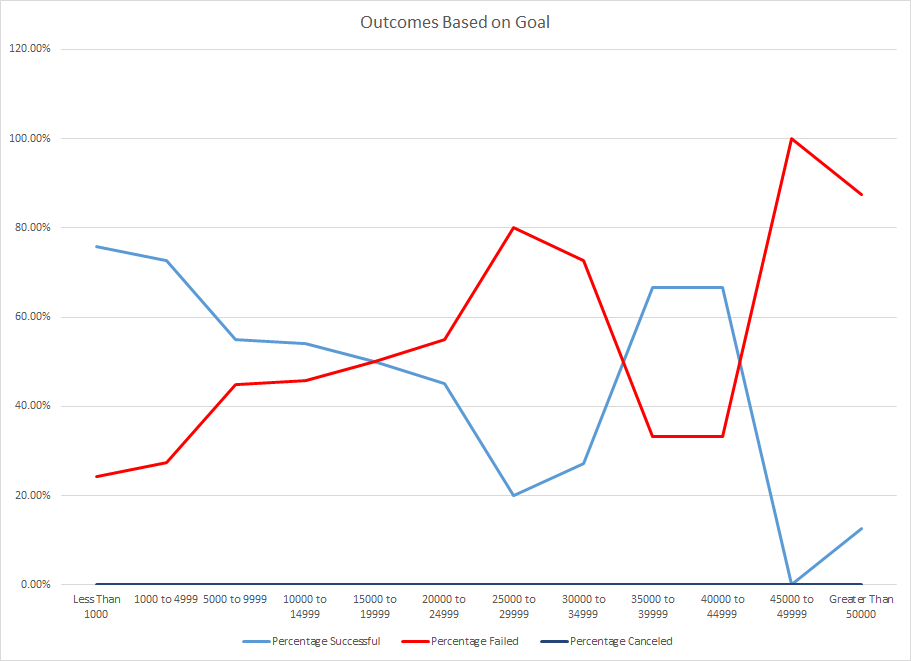
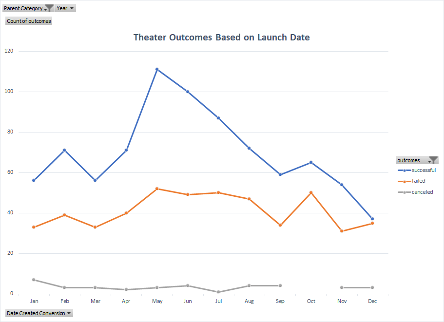

# An Analysis of Kickstarter Campaigns
#
## Performing analysis on Kickstarter data to uncover when and how much should Louise launch her Kickstart campaign to fund her theater

Kickstart data of 4112 historical campaigns were analyzed based on the following criteras:

- The dollar goals of successful US campaigns
- The success of theater funding campaigns launched throughout the year

The possible challenge to using the historical data are:

- The data set is relatively small (<5,000)
- THe data set contains not only US data, but those campaigns held in other countries
- The data set is historical, any macro-economic changes could have substantial impact to the actual result

### Results:

### Based on the data, an campaign amount between $45,000 and $49,000 is the ideal campaign amount.

### Based on the data, May is the ideal month to lauch theater funding campaign.
### Based on the data, the number of successful theater funding campaign declines from May to December.

#### Additional analysis should be performed to find out the average number of backers and the average contribution amount.

